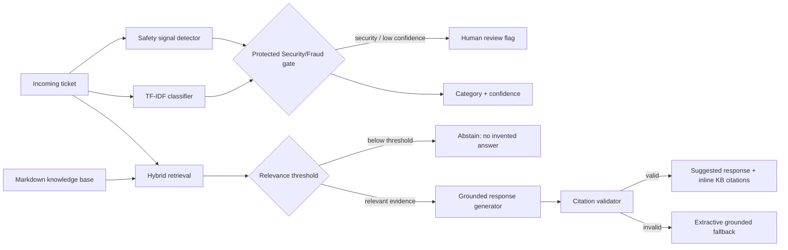

# Architecture

Local setup and dependency details are documented in [environment.md](environment.md).
Import and setup decisions are recorded in [decisions.md](decisions.md).

## Engineering choices

The classifier is intentionally small, inspectable, and cheap. With roughly 500 weak labels, a large fine-tuned model would add operational complexity without enough clean supervision to justify it. Word and character TF-IDF features provide a strong baseline for short support text, while class weighting corrects the dominant General Inquiry class.

Security/Fraud is handled as an asymmetric-risk class. A separate high-recall safety detector runs before normal routing, and a low Security/Fraud probability floor triggers human review even when another class wins. This avoids a design where a high aggregate accuracy hides dangerous minority-class failures.

Retrieval combines lexical BM25-style matching with local semantic similarity. The semantic backend uses `BAAI/bge-small-en-v1.5` when `sentence-transformers` is installed, and falls back to TF-IDF similarity when it is not. Generation is evidence-gated: if retrieval is weak, the system abstains. If Ollama is enabled, the prompt restricts the open-weight model to retrieved context and a validator checks that output citations point only to retrieved sources; otherwise a deterministic grounded fallback is used.
