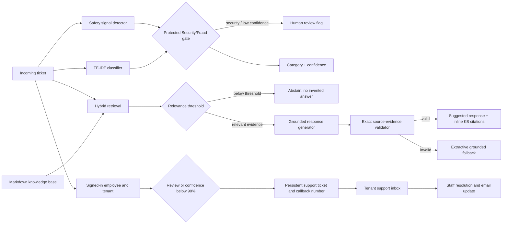

# Architecture

Local setup and dependency details are documented in [environment.md](environment.md).
Import and setup decisions are recorded in [decisions.md](decisions.md).
The support workflow and presentation states are documented in [ui.md](ui.md).
Accounts, Employee IDs, support tickets, and email delivery are documented in
[support_workflow.md](support_workflow.md).

## Engineering choices

The classifier is intentionally small, inspectable, and cheap. With roughly 500 weak labels, a large fine-tuned model would add operational complexity without enough clean supervision to justify it. Word and character TF-IDF features provide a strong baseline for short support text, while class weighting corrects the dominant General Inquiry class.

Security/Fraud is handled as an asymmetric-risk class. A separate high-recall safety detector runs before normal routing, and a low Security/Fraud probability floor triggers human review even when another class wins. This avoids a design where a high aggregate accuracy hides dangerous minority-class failures.

Retrieval ranks with BM25 and local embeddings when available, or TF-IDF similarity
in the lightweight environment. Answer eligibility is separate from relative ranking:
it checks absolute similarity/raw BM25, query coverage, and meaningful matched terms.
Weak matches abstain and require review. Optional Ollama output must return structured
claims whose text exactly matches evidence in the cited article; otherwise extraction
is used. Valid citation identifiers alone are no longer sufficient.

The user-selected review threshold is 90%. The same review decision controls the
pipeline flag, customer UI, and support queue. Requests below that threshold, security
risks, unsupported queries, and explicit requests for a person create human-review
tickets. Account phone numbers are passed to the tenant's support team, separately
from model input. Ticket events and notification outbox writes are transactional.
